# Classical Machine Learning on the Iris Dataset

A comprehensive exploration of classical machine learning techniques applied to the [Iris dataset](https://archive.ics.uci.edu/ml/datasets/iris), originally introduced by R.A. Fisher (1936). The project covers the full pipeline — from exploratory data analysis and dimensionality reduction to Gaussian classifiers, logistic regression, SVMs, and GMMs — implemented from scratch in Python using NumPy and SciPy.

## Table of Contents

- [Dataset Overview](#dataset-overview)
- [Project Structure](#project-structure)
- [How to Run](#how-to-run)
- [Notebooks](#notebooks)
  - [01 — Plots and Statistics](#01--plots-and-statistics)
  - [02 — PCA and LDA](#02--pca-and-lda)
  - [03 — Log-Likelihood](#03--log-likelihood)
  - [04 — Gaussian Classifiers](#04--gaussian-classifiers)
  - [05 — Logistic Regression](#05--logistic-regression)
  - [06 — SVM](#06--svm)
  - [07 — GMM](#07--gmm)
- [Utility Functions Reference](#utility-functions-reference)
- [Results Summary](#results-summary)

---

## Dataset Overview

The Iris dataset contains **150 samples** (instances) of iris flowers belonging to **3 classes** (50 each):

| Class | Label |
|-------|-------|
| Iris Setosa | 0 |
| Iris Versicolor | 1 |
| Iris Virginica | 2 |

Each sample is described by **4 features**: sepal length (cm), sepal width (cm), petal length (cm), petal width (cm).

---

## Project Structure

```
classical-ml-iris/
├── README.md
├── notebook/
│   ├── 01_Plots_And_Statistics.ipynb   # EDA: histograms, scatter plots, statistics
│   ├── 02_PCA_LDA.ipynb                # Dimensionality reduction & LDA classification
│   ├── 03_LogLikelihood.ipynb          # Gaussian density estimation & log-likelihood
│   ├── 04_Gaussian_Classifiers.ipynb   # MVG, Naive Bayes, Tied Covariance classifiers
│   ├── 05_Logistic_Regression.ipynb    # Binary logistic regression (standard & weighted)
│   ├── 06_SVM.ipynb                    # Linear, polynomial-kernel, and RBF-kernel SVMs
│   ├── 07_GMM.ipynb                    # Gaussian Mixture Model classification
│   ├── images/                         # Gaussian-fit plots generated by notebook 03
│   └── npy/                            # Pre-computed numpy arrays (joint scores, etc.)
├── scripts/
│   ├── utils.py                        # Dataset loading, statistics, plotting helpers
│   ├── dimensionalityreduction.py      # PCA and LDA training / projection
│   ├── loglikelihood.py                # Multivariate Gaussian log-pdf & log-likelihood
│   ├── pca_lda_classifiers.py          # LDA and PCA+LDA binary classifiers
│   ├── gaussianclass.py                # MVG, Naive Bayes, Tied Covariance classifiers
│   ├── logisticreg.py                  # Binary logistic regression (L-BFGS-B)
│   ├── SVM.py                          # Linear and kernel SVM (dual formulation)
│   ├── GMM.py                          # GMM with EM and LBG algorithms
│   └── bayes_error.py                  # Confusion matrix, DCF, minDCF, Bayes decisions
└── images/                             # All output plots referenced in this README
```

---

## How to Run

### Prerequisites

| Package | Purpose |
|---------|---------|
| Python ≥ 3.8 | Runtime |
| NumPy | Linear algebra, data manipulation |
| SciPy | Optimization (L-BFGS-B), special functions |
| Matplotlib | Plotting |
| scikit-learn | Dataset loading (`load_iris`) |

Install dependencies:

```bash
pip install numpy scipy matplotlib scikit-learn
```

### Running the Notebooks

1. Launch Jupyter from the project root:
   ```bash
   jupyter notebook
   ```
2. Open notebooks in order (`01_` → `07_`). Each notebook imports helpers from `scripts/` using relative imports (e.g. `from scripts.utils import *`), so **Jupyter must be started from the repository root**.
3. Run all cells top-to-bottom. Plots are rendered inline and also saved to the `images/` directories.

---

## Notebooks

### 01 — Plots and Statistics

Exploratory Data Analysis on the full 3-class dataset.

#### Univariate Distributions

Histograms of each feature show how well each one discriminates between classes:

| Feature | Discriminating Power | Plot |
|---------|---------------------|------|
| Sepal Length | Partial (bimodal, setosa shorter) | 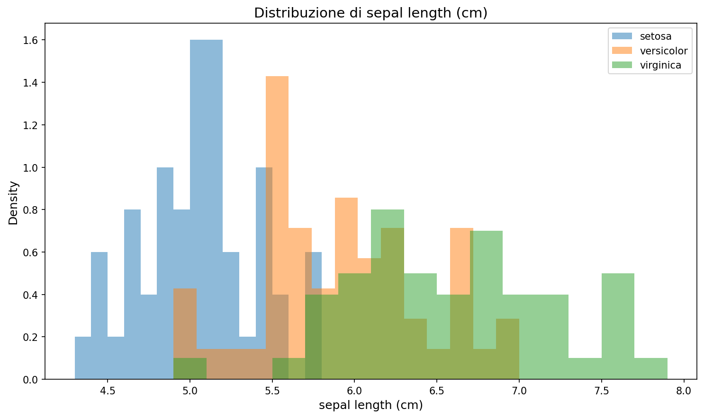 |
| Sepal Width | Weak (high overlap) | 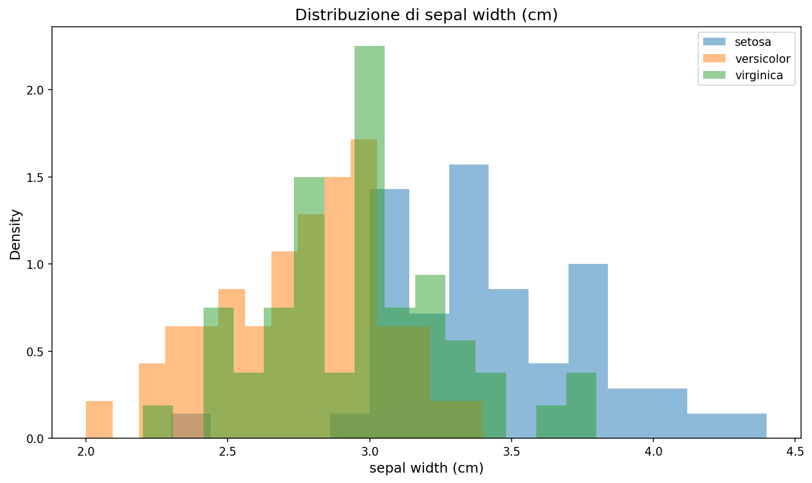 |
| Petal Length | **Excellent** (setosa clearly separated) | 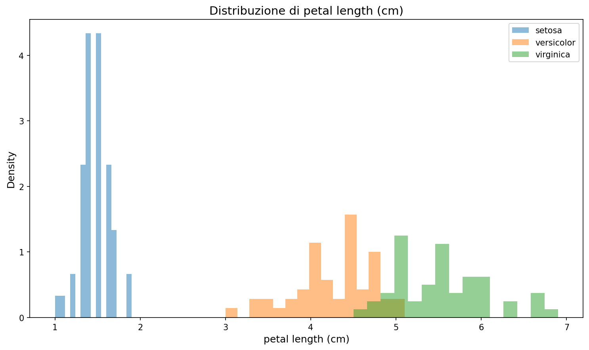 |
| Petal Width | **Excellent** (setosa clearly separated) | 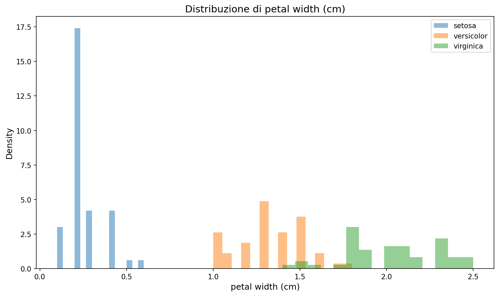 |

#### Bivariate Scatter Plots

Pairwise scatter plots reveal:
- A clear linear separation between setosa and the other two classes when petal features are used
- Versicolor and virginica show greater overlap but remain partially separable
- The combination of petal length and petal width provides the best visual separation

| Sepal features | Petal features |
|:-:|:-:|
| 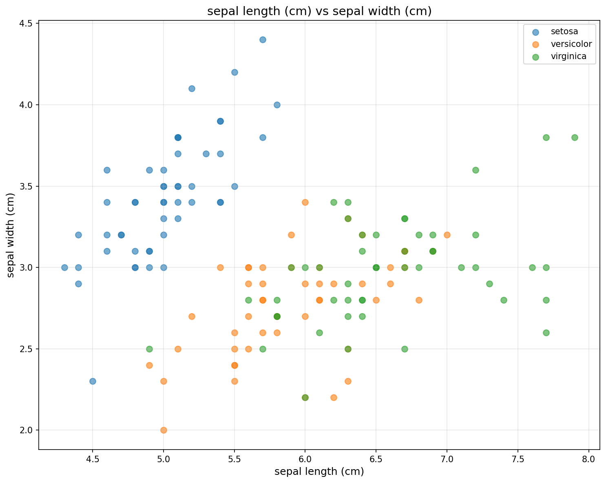 | 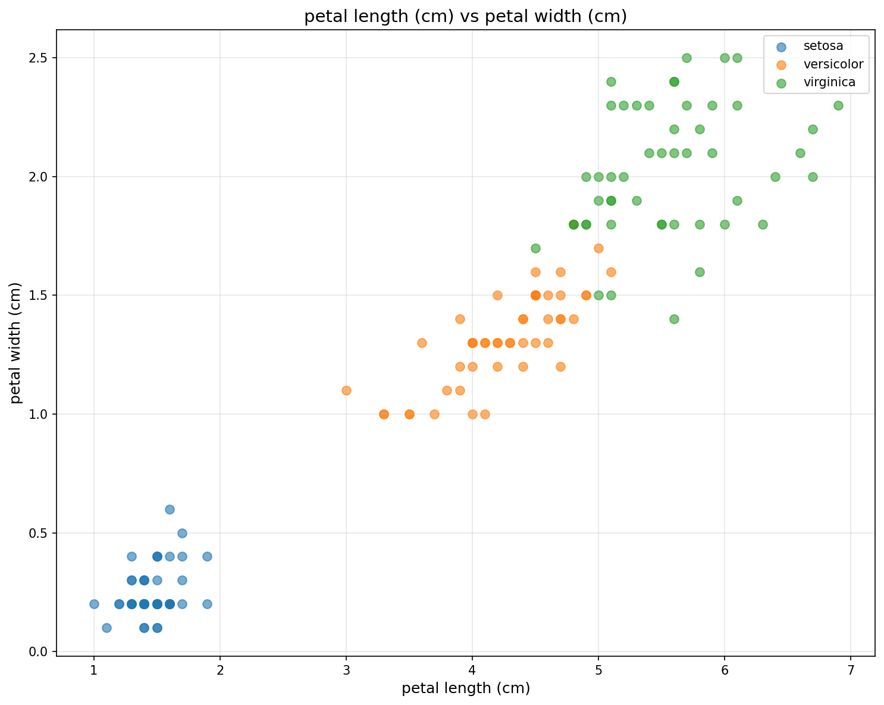 |

Mixed sepal–petal scatter plots:

| | |
|:-:|:-:|
| 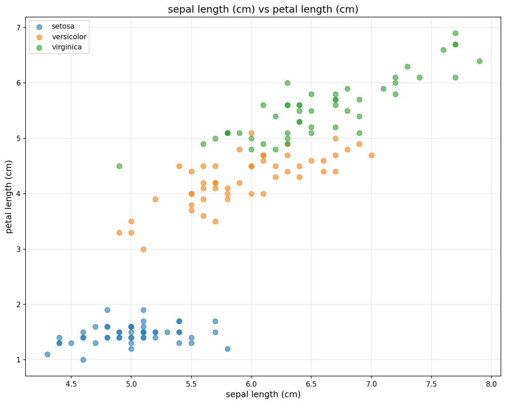 | 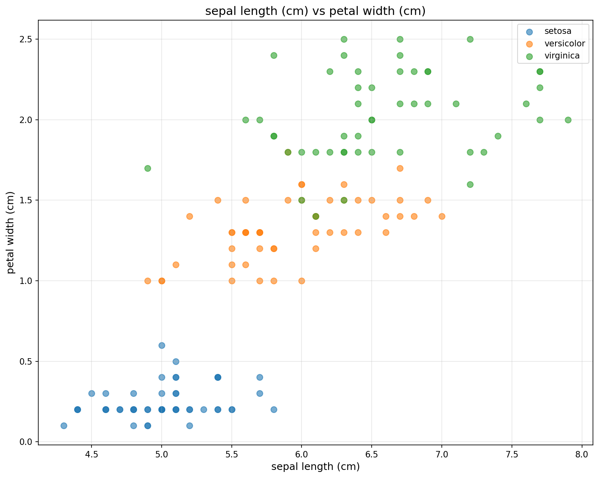 |
| 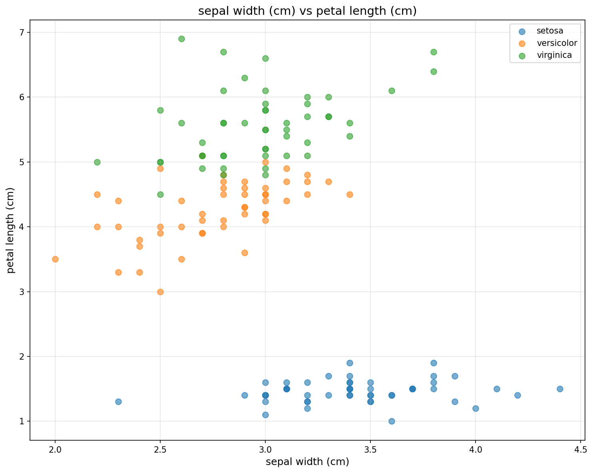 | 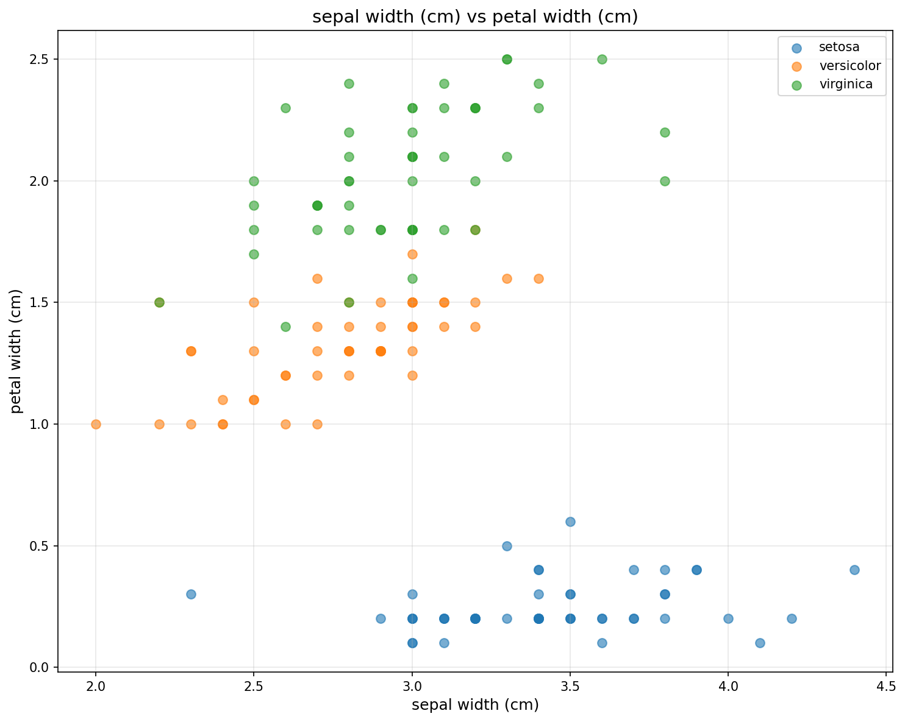 |

#### Descriptive Statistics

**Global mean** (all samples):
```
[5.843, 3.057, 3.758, 1.199] cm
```

**Per-class means**:

| Class | Sepal L | Sepal W | Petal L | Petal W |
|-------|---------|---------|---------|---------|
| Setosa | 5.006 | 3.428 | 1.462 | 0.246 |
| Versicolor | 5.936 | 2.770 | 4.260 | 1.326 |

Key observation: petal features show the most dramatic inter-class differences.

#### Covariance Matrices

<details>
<summary>Global covariance</summary>

```
[[ 0.681, -0.042,  1.266,  0.513]
 [-0.042,  0.189, -0.327, -0.121]
 [ 1.266, -0.327,  3.096,  1.287]
 [ 0.513, -0.121,  1.287,  0.577]]
```
</details>

<details>
<summary>Setosa covariance</summary>

```
[[0.122, 0.097, 0.016, 0.010]
 [0.097, 0.141, 0.011, 0.009]
 [0.016, 0.011, 0.030, 0.006]
 [0.010, 0.009, 0.006, 0.011]]
```
</details>

<details>
<summary>Versicolor covariance</summary>

```
[[0.261, 0.083, 0.179, 0.055]
 [0.083, 0.097, 0.081, 0.040]
 [0.179, 0.081, 0.216, 0.072]
 [0.055, 0.040, 0.072, 0.038]]
```
</details>

Notable patterns:
- Petal features have much higher variance than sepal features
- Strong positive correlation between petal length and petal width
- Setosa class is much more homogeneous (lower variance) than versicolor

---

### 02 — PCA and LDA

Dimensionality reduction applied to the full 3-class dataset.

#### PCA (2 components)

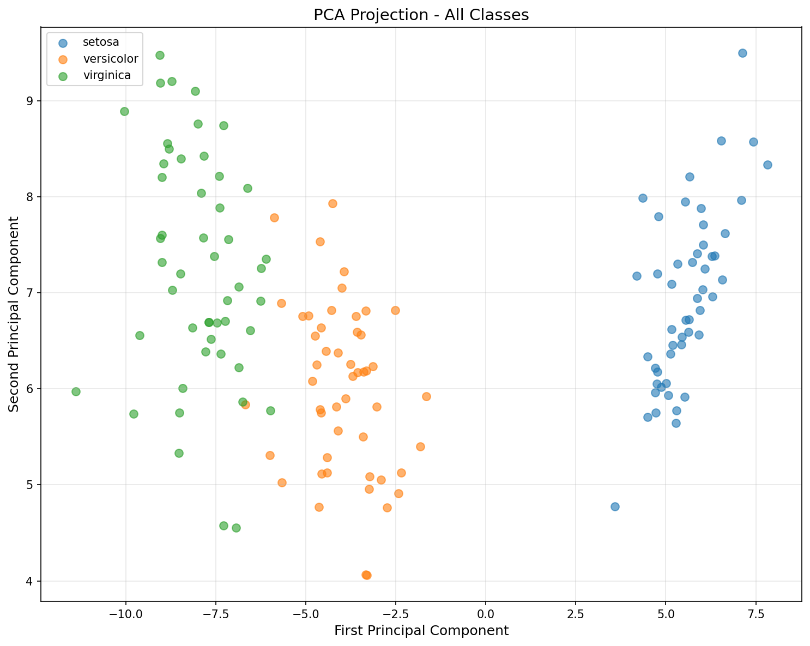

- The first principal component captures most of the total variance
- Setosa is clearly separated along PC1; versicolor and virginica overlap more than with the original petal features

#### LDA (2 components)

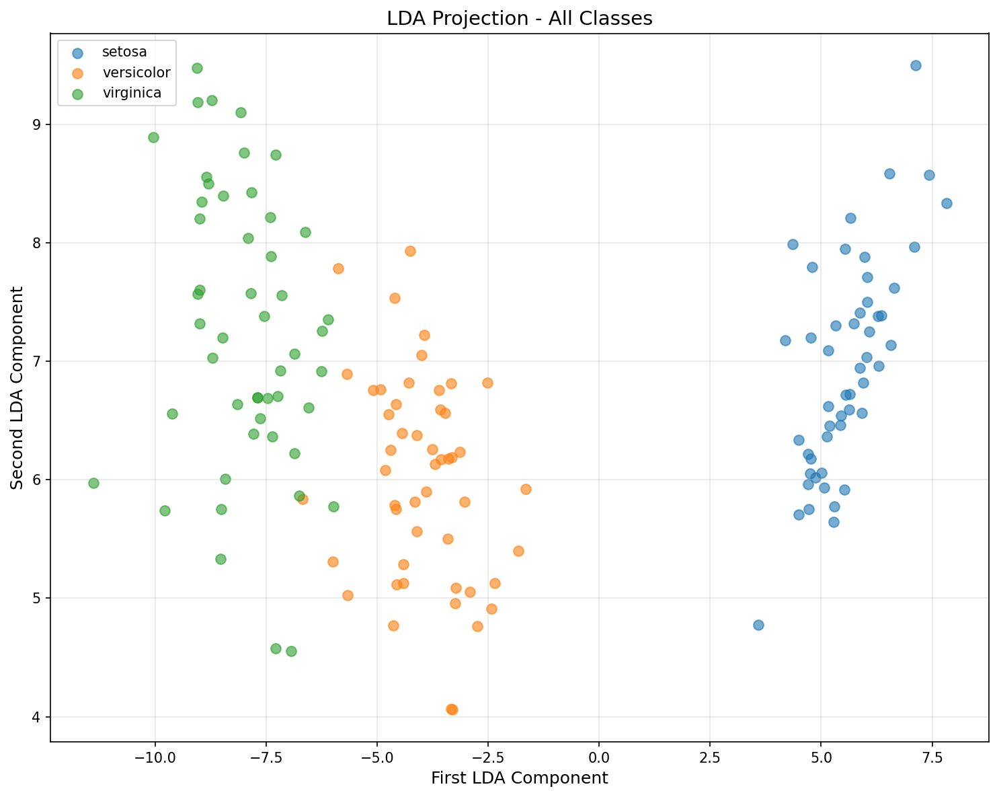

- Being supervised, LDA achieves a much sharper class separation than PCA
- All three classes form distinct, well-separated clusters

#### LDA Binary Classifier (Versicolor vs Virginica)

The binary dataset (100 samples, 50 per class) is split 2/3 training – 1/3 validation (seed = 0).

**LDA-only results:**
- Threshold: 4.079 | Errors: 2/34 | **Error rate: 5.9%**

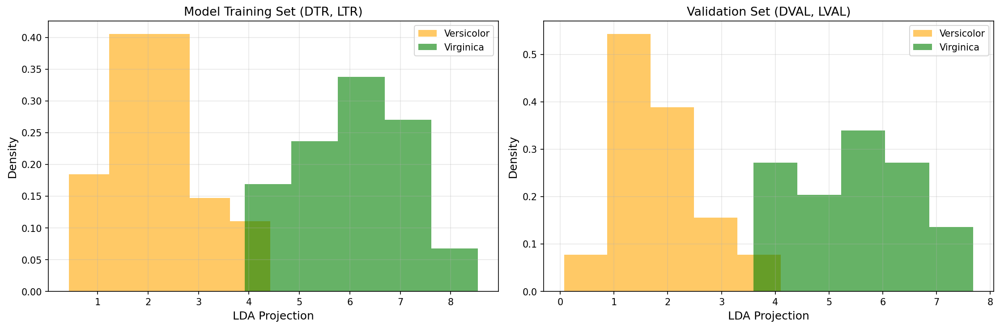

**PCA + LDA results** (varying PCA dimensionality `m`):

| PCA dims (m) | Threshold | Errors | Error Rate |
|:---:|:---:|:---:|:---:|
| 1 | 10.885 | 4 | 11.8% |
| 2 | 5.354 | 2 | 5.9% |
| 3 | 4.535 | 2 | 5.9% |
| 4 | 4.079 | 2 | 5.9% |

Key takeaway: the first PCA component alone loses discriminative information (maximizing variance ≠ maximizing class separability). With m ≥ 2, PCA+LDA matches pure LDA performance.

---

### 03 — Log-Likelihood

Gaussian density estimation and per-class Gaussian fits.

#### Gaussian Fits per Feature

For each feature, class-conditional Gaussian distributions $\mathcal{N}(\mu_c, \sigma_c^2)$ are estimated and overlaid on the empirical histograms:

| Sepal Length | Sepal Width |
|:-:|:-:|
| 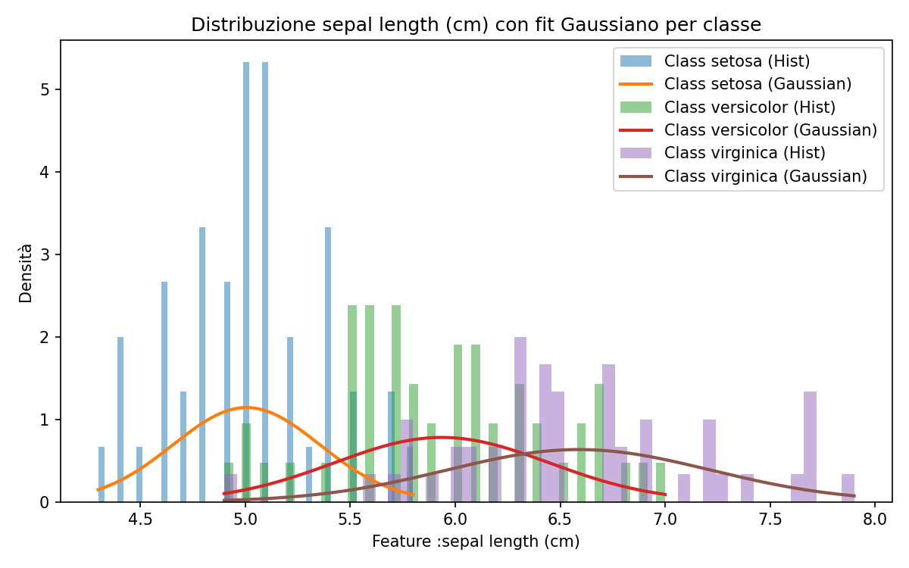 | 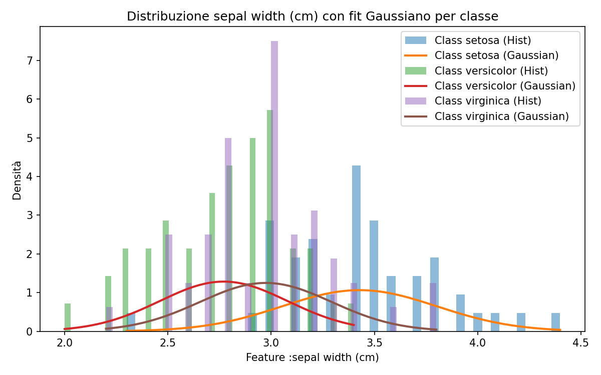 |

| Petal Length | Petal Width |
|:-:|:-:|
| 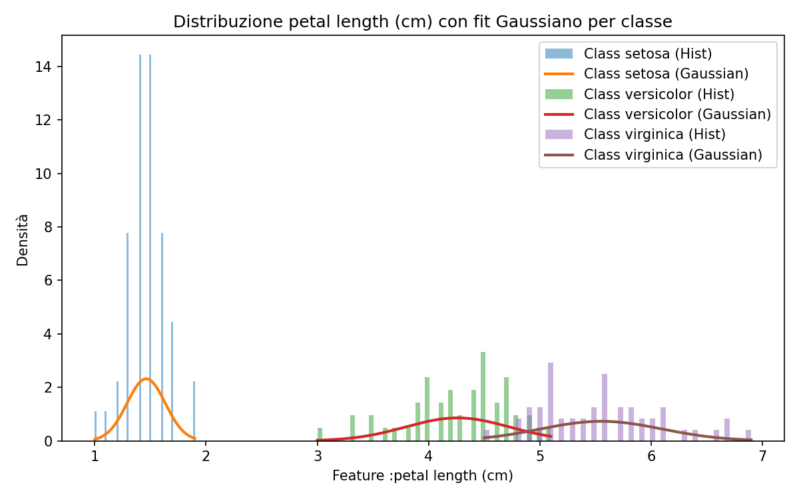 | 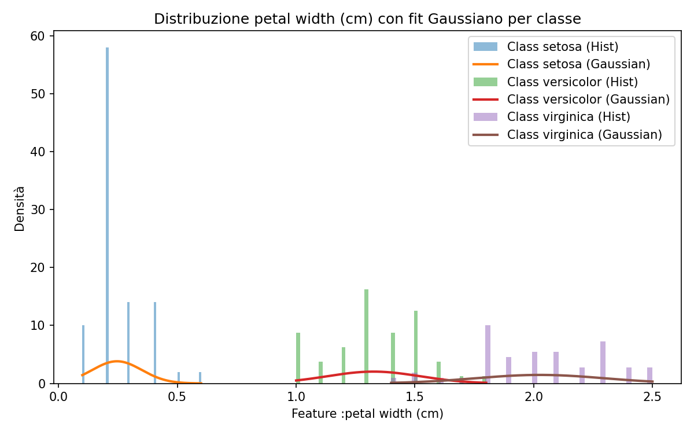 |

Observations:
- Petal features show the clearest inter-class Gaussian separation
- Sepal width is the least discriminative feature (overlapping Gaussian curves)
- Setosa is always well-separated from versicolor/virginica

---

### 04 — Gaussian Classifiers

Three multivariate Gaussian classifiers are compared on the 3-class problem, followed by binary (versicolor vs virginica) evaluation.

#### Model Definitions

| Model | Covariance Structure | Decision Boundary |
|-------|---------------------|-------------------|
| **MVG** (Full) | Per-class $\Sigma_c$ | Quadratic |
| **Naive Bayes** | Per-class diagonal $\text{diag}(\Sigma_c)$ | Quadratic (axis-aligned) |
| **Tied Covariance** | Shared $\Sigma$ across classes | Linear |

#### 3-Class Results

| Model | Error Rate | Accuracy |
|-------|:---:|:---:|
| MVG | 4.0% | 96.0% |
| Naive Bayes | 4.0% | 96.0% |
| **Tied Covariance** | **2.0%** | **98.0%** |

#### Binary Results (Versicolor vs Virginica)

Classification via log-likelihood ratio: $s(x)=\log f(x \mid C{=}2) - \log f(x \mid C{=}1)$, with threshold $t=0$ under equal priors.

| Model | Error Rate | Accuracy |
|-------|:---:|:---:|
| MVG | 8.82% | 91.18% |
| Naive Bayes | 11.76% | 88.24% |
| **Tied Covariance** | **5.88%** | **94.12%** |

Tied Covariance achieves the best result, matching the LDA error rate (~5.9%), consistent with the theoretical equivalence between LDA and Gaussian classification with shared covariance.

---

### 05 — Logistic Regression

Binary logistic regression (versicolor vs virginica) with L2 regularization, optimized via L-BFGS-B. Evaluated with error rate, min DCF, and actual DCF.

#### Standard Logistic Regression

| $\lambda$ | Error Rate | min DCF ($\pi$=0.5) | actual DCF ($\pi$=0.5) |
|:---:|:---:|:---:|:---:|
| $10^{-3}$ | 8.8% | 0.0625 | 0.1181 |
| $10^{-1}$ | 11.8% | **0.0556** | **0.1111** |
| $1$ | 14.7% | 0.1111 | 0.1667 |

Best trade-off: $\lambda=10^{-1}$ (lowest min DCF and actual DCF).

#### Prior-Weighted Logistic Regression ($\pi_T$ = 0.8)

| $\lambda$ | Error Rate | min DCF ($\pi_T$=0.8) | actual DCF ($\pi_T$=0.8) |
|:---:|:---:|:---:|:---:|
| $10^{-3}$ | 11.8% | 0.1667 | **0.2222** |
| $10^{-1}$ | 38.2% | **0.0556** | 0.7222 |
| $1$ | 52.9% | 0.1111 | 1.0000 |

The weighted variant shows a large gap between min DCF and actual DCF, indicating poorly calibrated scores. Without post-hoc calibration, the standard variant is more robust.

---

### 06 — SVM

Binary SVM (versicolor vs virginica) in dual formulation, with three kernel types.

#### Linear SVM

| K | C | Error Rate | min DCF | actual DCF |
|:---:|:---:|:---:|:---:|:---:|
| 1.0 | 0.1 | **2.9%** | 0.0556 | 0.0625 |
| 1.0 | 1.0 | 5.9% | 0.0556 | 0.1181 |
| 1.0 | 10.0 | 5.9% | 0.0556 | 0.1181 |
| 10.0 | 0.1 | 11.8% | **0.0000** | 0.2222 |
| 10.0 | 1.0 | 5.9% | 0.0556 | 0.1181 |
| 10.0 | 10.0 | 5.9% | 0.0625 | 0.1181 |

#### Polynomial Kernel SVM (degree 2)

| K | C | c | Error Rate | min DCF | actual DCF |
|:---:|:---:|:---:|:---:|:---:|:---:|
| 0.0 | 1.0 | 0.0 | 8.8% | 0.0625 | 0.1736 |
| 1.0 | 1.0 | 0.0 | 8.8% | 0.0625 | 0.1736 |
| 0.0 | 1.0 | 1.0 | **2.9%** | **0.0556** | **0.0556** |
| 1.0 | 1.0 | 1.0 | **2.9%** | **0.0556** | **0.0556** |

#### RBF Kernel SVM

| K | C | $\gamma$ | Error Rate | min DCF | actual DCF |
|:---:|:---:|:---:|:---:|:---:|:---:|
| 0.0 | 1.0 | 1.0 | 8.8% | 0.0625 | 0.1736 |
| 1.0 | 1.0 | 1.0 | 8.8% | 0.0625 | 0.1736 |
| 0.0 | 1.0 | 10.0 | 11.8% | 0.1736 | 0.2292 |
| 1.0 | 1.0 | 10.0 | 8.8% | 0.1736 | 0.1736 |

**Best overall**: Polynomial kernel with c=1, d=2 — best combined error rate (2.9%), min DCF and actual DCF. The kernel offset `c` is critical: c=1 dramatically outperforms c=0. RBF requires finer $\gamma$/C tuning to be competitive.

---

### 07 — GMM

Gaussian Mixture Model classifier on the full 3-class problem, using the LBG splitting algorithm with constrained EM (eigenvalue floor $\psi$).

| GMM Components | Error Rate |
|:---:|:---:|
| 1 | 4.00% |
| 2 | 4.00% |
| 4 | 4.00% |
| 8 | 4.00% |
| 16 | 4.00% |

Performance is **stable** across all component counts — Iris is simple enough to be well-modeled by single Gaussians per class. The covariance regularization ($\psi$) prevents numerical degeneracies during EM.

---

## Utility Functions Reference

A summary of the helper functions organized by module. All scripts are in the `scripts/` directory.

### `utils.py` — Data Loading & Statistics
| Function | Description |
|----------|-------------|
| `init_dataset()` | Loads full Iris dataset, returns features, labels, class/feature names |
| `init_dataset_for_binary_classification()` | Loads Iris filtered to classes 1 and 2 only |
| `load_iris_binary()` | Loads binary Iris with labels remapped to {0, 1} |
| `split_db_2to1(D, L, seed)` | 2:1 train/validation split |
| `getMu(D)` | Mean vector |
| `getC(D)` | Sample covariance matrix |
| `getRow(v)` / `getCol(v)` | Reshape to row/column vector |
| `compute_Sb_Sw(D, L)` | Between-class and within-class covariance matrices |
| `get_hist(...)` / `get_scatters(...)` | Histogram and scatter plot generation |

### `dimensionalityreduction.py` — PCA & LDA
| Function | Description |
|----------|-------------|
| `train_PCA(X, m)` | Computes PCA projection matrix (top `m` eigenvectors) |
| `apply_PCA(X, P, mu)` | Projects data onto PCA subspace |
| `train_LDA(X, L, m)` | Computes LDA transformation matrix |
| `apply_LDA(X, W)` | Projects data onto LDA subspace |

### `loglikelihood.py` — Gaussian Density
| Function | Description |
|----------|-------------|
| `logpdf_GAU_ND(x, mu, C)` | Multivariate Gaussian log-pdf |
| `loglikelihood(XND, m_ML, C_ML)` | Total log-likelihood of a dataset under a Gaussian model |

### `pca_lda_classifiers.py` — LDA-Based Classifiers
| Function | Description |
|----------|-------------|
| `LDA_classifier(DTR, LTR, DVAL, LVAL)` | Train & evaluate LDA binary classifier |
| `LDA_with_PCA_classifier(DTR, LTR, DVAL, LVAL, m)` | Train & evaluate PCA+LDA binary classifier |

### `gaussianclass.py` — Gaussian Classifiers
| Function | Description |
|----------|-------------|
| `get_params_MVG(DTR, LTR)` | Estimate MVG parameters (per-class mean & covariance) |
| `get_params_Naive_Bayes(DTR, LTR)` | Estimate Naive Bayes parameters (diagonal covariance) |
| `get_params_Tied_Covariance(DTR, LTR)` | Estimate Tied Covariance parameters (shared covariance) |
| `getS(...)` / `getSJoint(...)` / `getSPost(...)` | Score, joint probability, and posterior computation |

### `logisticreg.py` — Logistic Regression
| Function | Description |
|----------|-------------|
| `trainLogReg(DTR, LTR, l)` | L2-regularized binary logistic regression (L-BFGS-B) |
| `weighted_trainLogReg(DTR, LTR, l, piT)` | Prior-weighted logistic regression |

### `SVM.py` — Support Vector Machines
| Function | Description |
|----------|-------------|
| `train_SVM(K, C, DTR, LTR)` | Dual linear SVM |
| `train_kernel_poly_SVM(...)` | Dual polynomial-kernel SVM |
| `train_kernel_KRB(...)` | Dual RBF-kernel SVM |
| `polygrad_d(...)` / `KRB(...)` | Polynomial / RBF kernel matrices |
| `regular_kernel(kernel, xi)` | Add bias regularization to kernel |

### `GMM.py` — Gaussian Mixture Models
| Function | Description |
|----------|-------------|
| `logpdf_GMM(X, gmm)` | Component and marginal log-densities |
| `EM_constrained(...)` | Constrained EM algorithm (eigenvalue floor) |
| `split_gmm(gmm, alpha)` | Split GMM components (LBG step) |
| `LBG_constrained(...)` | Full LBG algorithm to grow a GMM |

### `bayes_error.py` — Evaluation Metrics
| Function | Description |
|----------|-------------|
| `get_confusion_mat(predictions, L)` | Confusion matrix |
| `DCF_u(...)` / `DCF_norm(...)` | Unnormalized / normalized Detection Cost Function |
| `get_bayes_decision(llr, pi, Cfn, Cfp)` | Bayes-optimal thresholding on log-likelihood ratios |
| `compute_min_dcf(...)` | Minimum DCF over all thresholds |

---

## Results Summary

| Method | Task | Error Rate | Notes |
|--------|------|:---:|-------|
| LDA | Binary (V vs Vi) | 5.9% | Midpoint threshold |
| PCA(2)+LDA | Binary (V vs Vi) | 5.9% | Matches pure LDA |
| MVG | 3-class | 4.0% | Full covariance per class |
| Naive Bayes | 3-class | 4.0% | Diagonal covariance |
| **Tied Covariance** | **3-class** | **2.0%** | **Shared covariance — best 3-class** |
| Tied Covariance | Binary (V vs Vi) | 5.88% | Equivalent to LDA |
| Log. Regression ($\lambda$=0.1) | Binary (V vs Vi) | 11.8% | Best DCF trade-off |
| **SVM Poly (d=2, c=1)** | **Binary (V vs Vi)** | **2.9%** | **Best binary result** |
| SVM Linear (K=1, C=0.1) | Binary (V vs Vi) | 2.9% | Competitive |
| GMM (1–16 comp.) | 3-class | 4.0% | Stable across all configurations |

---

## License

This project is for educational purposes.
